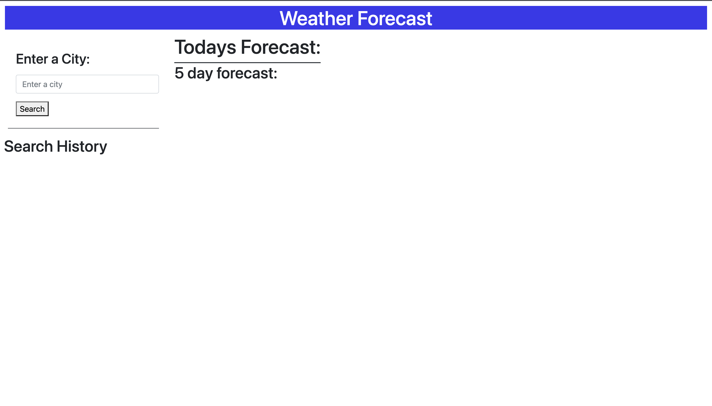

# weather app
Allows a user to input a city and receive weather data for the current day as well as the next 5 days.

## ScreenShots

## Links
Repo: https://github.com/RichardBaier/weather-app
Deployed: https://richardbaier.github.io/weather-app/